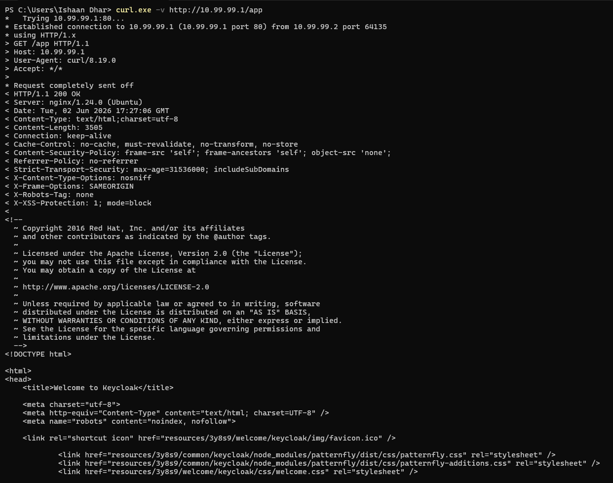
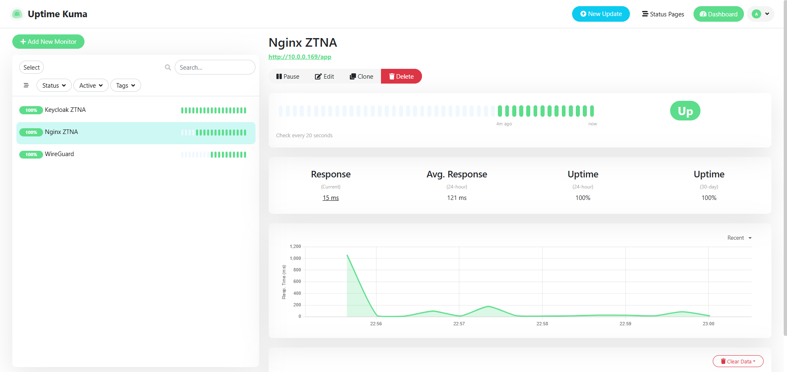
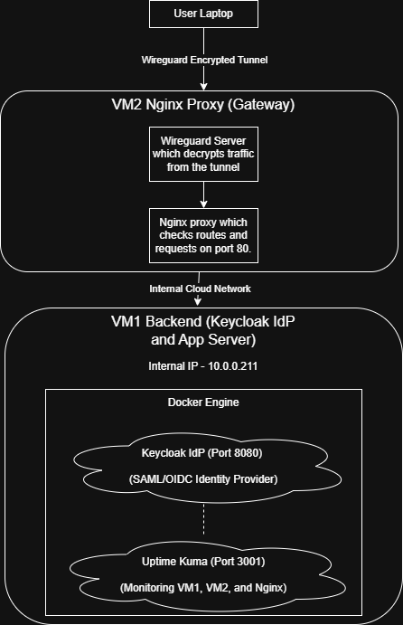

# Lab Capstone Findings and Architecture

## 1. Screenshot Evidence

**Curl Request Flows through the Full Stack:**

**3 Nginx Monitors:**

-------------------------------------------------------------------------------------------------------------------------------------------------------------------------

## 2. Architecture Diagram

-------------------------------------------------------------------------------------------------------------------------------------------------------------------------

## 3. Reflection

**How does this mini-ZTNA map to the real InstaSafe product? What is missing compared to a production deployment?**

This lab uses network, identity, and monitoring concepts to build a functional Zero Trust Network Access (ZTNA) environment. The result is an architecture that uses WireGuard, Nginx, and Keycloak to copy the core data flow of Instasafe’s product.

First, WireGuard acts as the direct equivalent of the InstaSafe Agent. It creates a secure, encrypted UDP tunnel from the client directly to the edge of the network, where the requests are handed to Nginx. Unlike old VPNs, WireGuard strictly acts as a cryptographic transport layer, making sure packets are encrypted during transfer without automatically granting broad internal network access, allowing lateral movement during attack situations.

Second, the Nginx reverse proxy on VM2 acts as the direct equal to the InstaSafe Gateway. Its main job is to secure application routing. Here, instead of allowing the viewing of backend servers to the public, Nginx stands on the edge of the network, listening only to the VPN’s subnet. It catches incoming traffic, checks the routing headers, and proxies the traffic through the internal cloud network to the isolated backend. This makes sure that the end user cannot see the internal topology of the network.

Third, Keycloak functions as the central Identity Provider (IdP), mirroring the role of AD. Before a user can interact with the app, Keycloak forces a secure authentication handshake process. The gateway depends on Keycloak to verify the identity of the user before any actual app data is shared to them. 

Finally, Uptime Kuma mirror Site24x7, continuously checking the infrastructure to ensure that the tunnel, proxy and IdP server are running and show status as UP.

*Gaps Between the Lab and a Real Production Deployment*

In our lab, Nginx blindly forwards traffic to the backend as long as the packet originates from the WireGuard tunnel. A real ZTNA gateway focuses on continuous authorization. It checks parameters—such as device posture, geographic location, OS patch levels, and time of day—before forwarding a single byte. If an endpoint is suspicious or compromised, a real ZTNA gateway instantly cuts the connection. Our lab setup doesn’t have this real-time contextual evaluation.

Our network rules lack strict micro-segmentation. To establish connectivity, I configured the firewall to trust the entire internal cloud subnet. An enterprise ZTNA model strictly uses highly granular micro-segmentation, locking firewalls to exact container to container IP addresses and specific ports. This prevents lateral movement; if a threat or attacker somehow accesses the proxy, they would still be contained inside.

Finally, our setup lacks centralized logging and threat analytics. A production environment transmits all access logs, failed authentication attempts, and network telemetry into a SIEM or threat intelligence platform for anomaly detection. Without this, there will be no logs for any incident, and failed/malicious access attempts, thus making it so that tracking active attacks or performing post-incident forensics is impossible.

----------------------------------------------------------------------------------------------------------------------------------------------------------------------------------------------------------------------------------------------------------------------------------------------------------------------------------------------------------------------------------------------------------------------------------------------------------------------------------------------------------------------------------------------------------------------------------------------------------------------------------------------------------------------------------------------------
