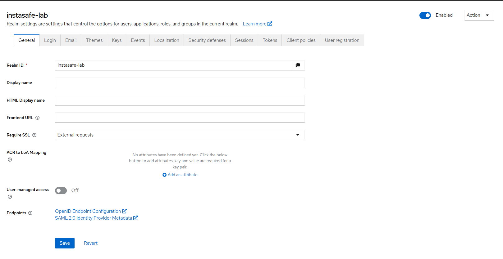
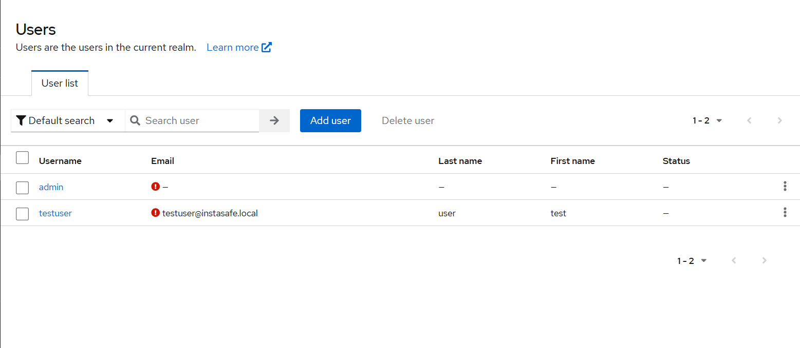
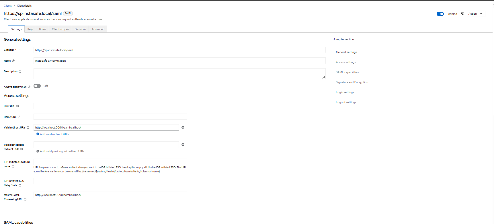
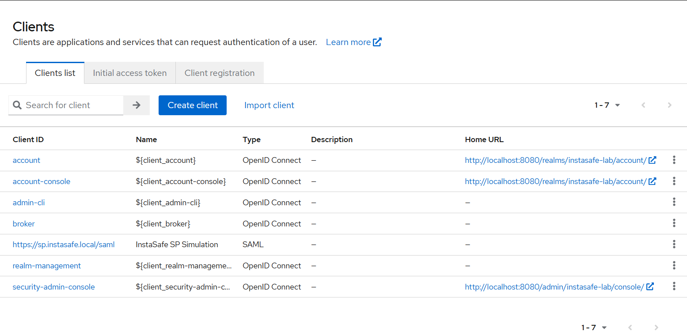
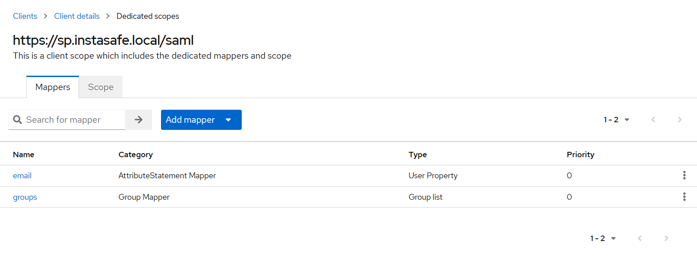
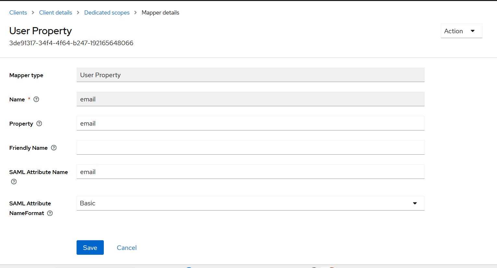
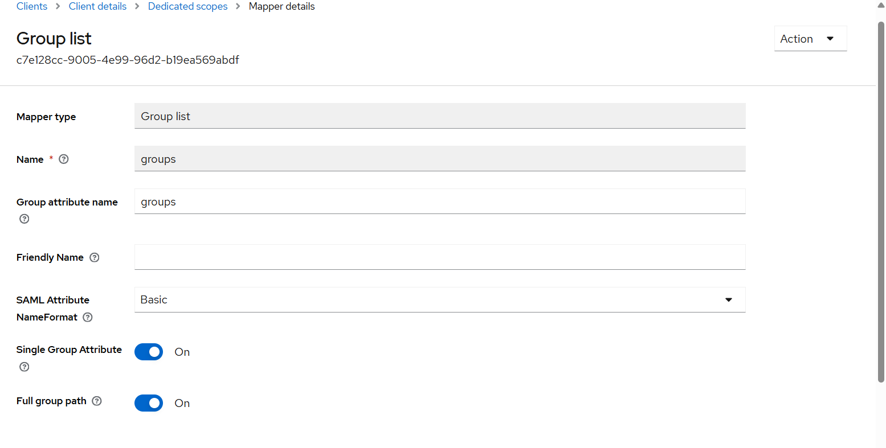
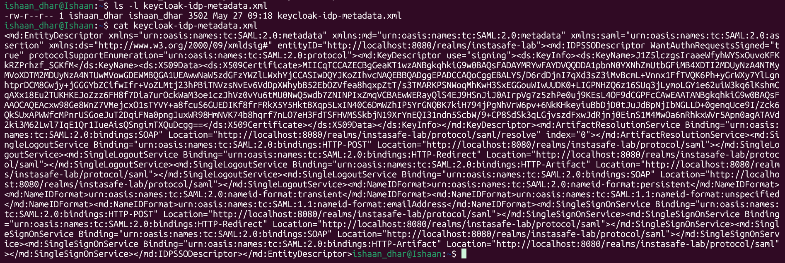
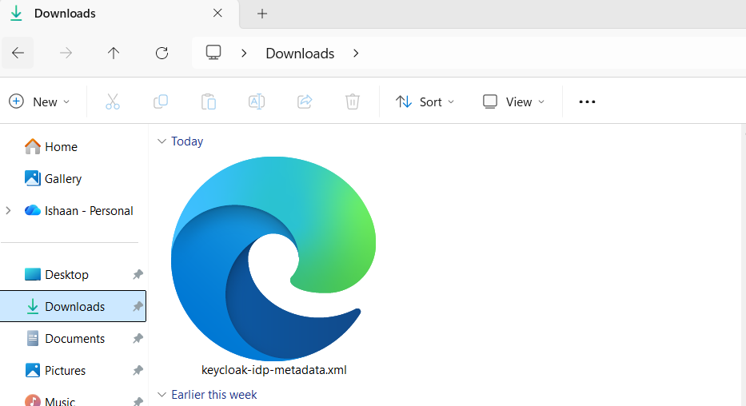
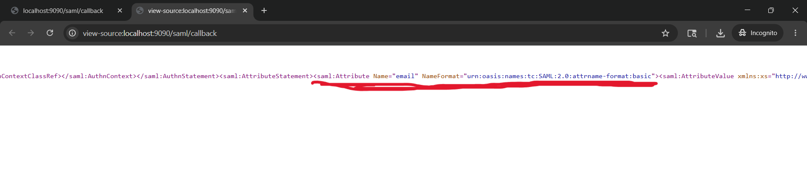

# Lab 2.2 Findings: KeyCloak and SAML Implementation

## 1. Screenshot Evidence

**Keycloak Admin Console Showing Realm:**

-------------------------------------------------------------------------------------------------------------------------------------------------------------------------

**Keycloak Admin Console Showing Users:**

-------------------------------------------------------------------------------------------------------------------------------------------------------------------------

**Keycloak Admin Console Showing SAML Type:**

-------------------------------------------------------------------------------------------------------------------------------------------------------------------------

**Keycloak Admin Console Showing Clients:**

-------------------------------------------------------------------------------------------------------------------------------------------------------------------------

**Keycloak Admin Console Showing Mappers:**

-------------------------------------------------------------------------------------------------------------------------------------------------------------------------

**Keycloak Admin Console Showing 'email' Mapper Configuration:**

-------------------------------------------------------------------------------------------------------------------------------------------------------------------------

**Keycloak Admin Console Showing 'groups' Mapper Configuration:**

-------------------------------------------------------------------------------------------------------------------------------------------------------------------------

**Keycloak IdP Metadata Raw:**

-------------------------------------------------------------------------------------------------------------------------------------------------------------------------

**Keycloak IdP Metadata Downloaded as .xml File:**

-------------------------------------------------------------------------------------------------------------------------------------------------------------------------

**'mail' Attribute found in Raw XML (Had to Use View Page Source First):**

-------------------------------------------------------------------------------------------------------------------------------------------------------------------------
----------------------------------------------------------------------------------------------------------------------------------------------------------------------------------------------------------------------------------------------------------------------------------------------------------------------------------------------------------------------------------------------------------------------------------------------------------------------------------------------------------------------------------------------------------------------------------------------------------------------------------------------------------------------------------------------------

## 2. Scenario Answer

**Scenario:** If a customer reports SSO users get "Attribute Error" during login, what in this Keycloak config would you check first?

**Troubleshooting Steps & Findings:**
When an "Attribute Error" is shown during this scenario, it definitely means that authentication is successfully taking place, but the data tags, like the email or groups that we configured are not being sent properly inside the SAML XML code. Or it is also possible that it is being sent to the wrong destination.

I would check two specific areas in the Keycloak configuration:

**1. The SAML Client Mappers (This caught me once)**
What is possible here is that the attribute name the Service expects and the attribute name sent by Keycloak dont match. The issue I faced here was that the InstaSafe Lab app I ran expected the role list to be labeled as 'groups', but I had not changed the default value that Keycloak had already assigned ('member'). As a result, I couldnt even open the login page in the first place.

* **Menu Path:** *Keycloak Admin Console -> Select Realm (instasafe-lab) -> Clients -> Client 'https://sp.instasafe.local/saml'(InstaSafe SP Simulation) -> Client scopes tab at the top-> Click the `https://sp.instasafe.local/saml-dedicated` link -> Then individually check and verify the Mappers tabs.*

**2. Verify the User's Profile Data**
Now, incase the mappers are correct, then this error might only be for some specific users. It might be entirely possible that the user's profile hasn't been properly configured, and is missing the required associations. That means that Keycloak is literally unable to send the data even if it wants to.

* **Menu Path:** *Keycloak Admin Console → Select Realm (instasafe-lab) → Users → Click the affected user.*