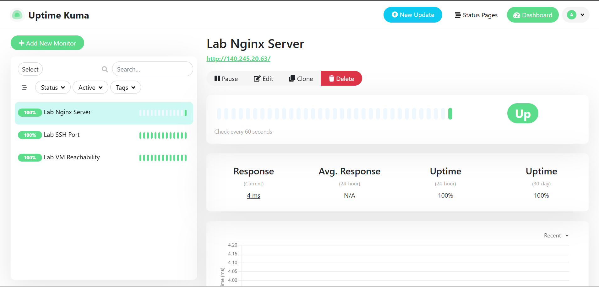
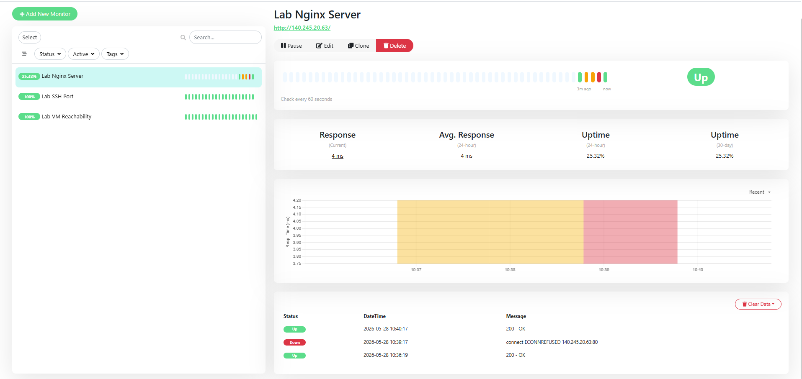

# Lab 3.1 Findings: Uptime Kuma

## 1. Screenshot Evidence

**3 Monitors Dashboard (Successful):**

-------------------------------------------------------------------------------------------------------------------------------------------------------------------------

**Failure Triggered and Captured:**

-------------------------------------------------------------------------------------------------------------------------------------------------------------------------

**Recovery and Timeline:**

----------------------------------------------------------------------------------------------------------------------------------------------------------------------------------------------------------------------------------------------------------------------------------------------------------------------------------------------------------------------------------------------------------------------------------------------------------------------------------------------------------------------------------------------------------------------------------------------------------------------------------------------------------------------------------------------------

## 2. Scenario Answer

**Scenario:** Map Uptime Kuma monitor types to Site24x7 monitor types. Which type would you use to monitor an InstaSafe Gateway?

**Monitor Type Mapping:**
Uptime Kuma and Site24x7 share the exact same monitor types, but Site24x7 is more detailed and specific about its capabilities:

* **HTTP(S) Monitor (Uptime Kuma)** --> **Website / REST API Monitor (Site24x7)**. Both check if a specific port on the server is open and ready to accept connections.

* **TCP Port Monitor (Uptime Kuma)** --> **Port / Custom TCP Monitor (Site24x7)**. Both verify that the website or web service loads correctly without showing an error.

* **Ping Monitor (Uptime Kuma)** --> **Ping Monitor (Site24x7)**. Both simply send a basic ping over the network to check if the server is on and reachable.

**InstaSafe Gateway Monitoring Rationale:**

To properly monitor an InstaSafe Gateway, the most important monitor to use is a **TCP Port Monitor**. The gateway's main function is to create and accept secure tunnels (over ports like TCP/UDP 443 or a custom port).

* If only a **Ping monitor** is used, it will only tell if the underlying operating system is on. If the gateway software crashes, the server will still reply to pings, incorrectly showing the status as "Up" while any and all users are unable to access the server through the software.

* A **TCP Port Monitor** checks if the gateway software is actually running and ready to accept user connections.