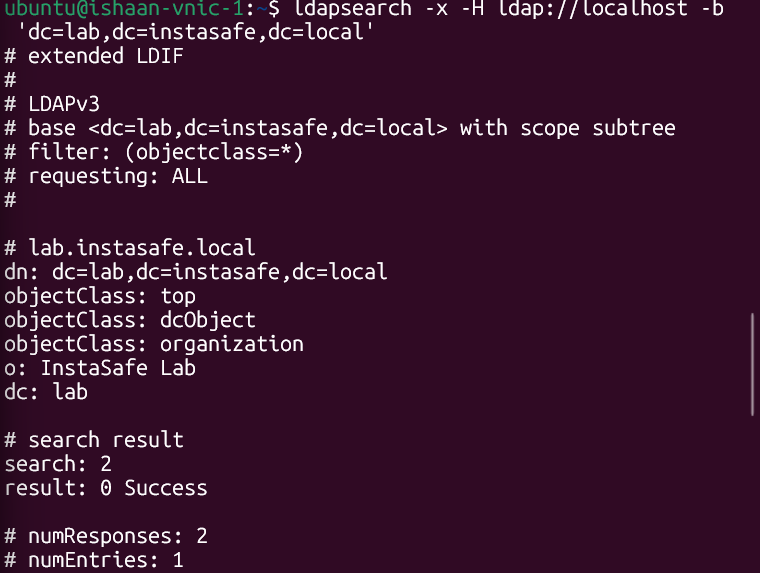
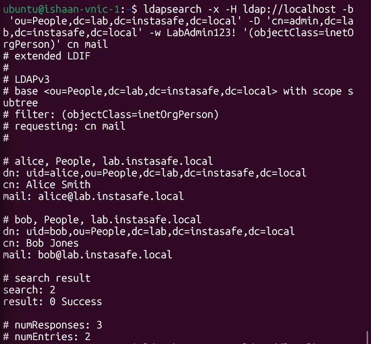
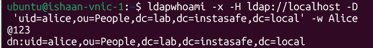
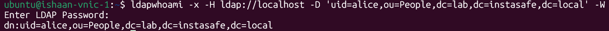
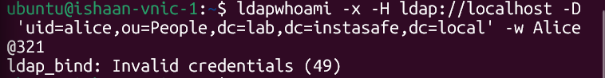
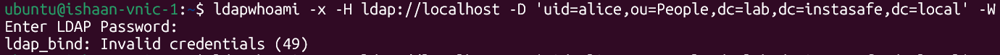

# Lab 2.1 Findings: LDAP Essentials

## 1. Screenshot Evidence

**Command 'ldapsearch' returns directory structure:**

----------------------------------------------------------------------------------------------------------------------------------

**Command 'ldapsearch' returns both users with mail attributes:**

----------------------------------------------------------------------------------------------------------------------------------

**Command 'ldapwhoami' returns user 'alice' successfully:**

----------------------------------------------------------------------------------------------------------------------------------

**Command 'ldapwhoami' returns user 'alice' unsuccessfully:**

----------------------------------------------------------------------------------------------------------------------------------------------------------------------------------------------------------------------------------------------------------------------------------------------------------------------------------------------------------------------------------------------------------------------------------------------------------------------------------------------------------------------------------------

In this case, an Error 49 message tells a support engineer that the request correctly reaches the server, but is being rejected due to incorrect credentials, here a wrong password. The support engineer can check the following things to actually troubleshoot the issue:

- Verify that the DN is correct. Here the DN is 'uid=alice,ou=People,dc=lab,dc=instasafe,dc=local'. If this is incorrect, the servers throws error because the DN has to be exactly matching to ensure correct binding.

- Checking the password will be a very common step. Most issues arise from incorrect passwords being entered during whoami attempts. In case of recently update d passwords, unless the directory is updated with the changed password, it will keep on showing the Error 49 message.

- Checking the account status in the directory. Sometimes an account may be disabled, locked due to too many wrong attempts, or some other issues related to authentication. These issues can also cause an Error 49 message.

- Incorrect syntax. In modern passwords, special symbols are generally mandatory, so special symbols can sometimes be entered while being incorrectly enclosed in the command line input. That issue can be resolved by making sure that the system is reading the string correctly.

----------------------------------------------------------------------------------------------------------------------------------
------------------------------------------------------------------------------------------------------------------------------------------------------------------------------------------------------------------------------------------------------------------------------------------------------------------------------------------------------------------------------------------------------

**BASE DISTINGUISED NAME {DN} (LDAP) --> NATIVE DIRECTORY (INSTASAFE):** In **LDAP**, the Base DN (dc=lab,dc=instasafe,dc=local) is where any directory search happens. It shows where exactly to look for users in the directory tree. In **InstaSafe**, on searching, it searches the specific organisations' native directory in the portal.

**BIND DISTIGUISHED NAME {DN} (LDAP)--> ADMIN ID/API KEY/USERID (INSTASAFE):** In **LDAP**, the Bind DN is the exact, fully written out identity of the user account or service account that has to be interacting with the database. The Bind DN and a password must be provided correctly to actually start reading or writing the database. In **InstaSafe**, instead of writing the full directory tree paths manually, Admin Accounts or Api Access Tokens can be used for administration or query purposes. Similarly, for client users, their parallel to Bind DN is simply their UserID, whih they use to connect to the network through the InstaSafe Agent.

**ATTRIBUTES (LDAP) --> STATIC PROFILE AND DYNAMIC ATTRIBUTES (INSTASAFE):** In **LDAP**, attributes are key-value pairs that make up an object of the user. Example s are userPassword, uid, mail, title, memberOf, etc. Parallelly in **InstaSafe**, static user profiles like Name, Email Address, Phone Number, etc. are stored in static profile fields. Additionally, due to zero-trust principles of InstaSafe, it continuously creates and maintains records of fluid attributes like Current IP, Geolocation and Device Posture (OS Version, AntiVirus, etc.). These two types, static and dynamic, are both used together to decide if access should be granted to the requester. 