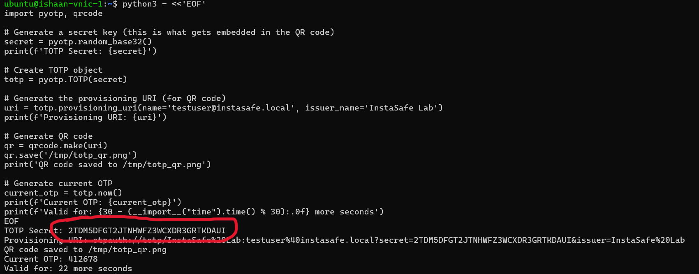
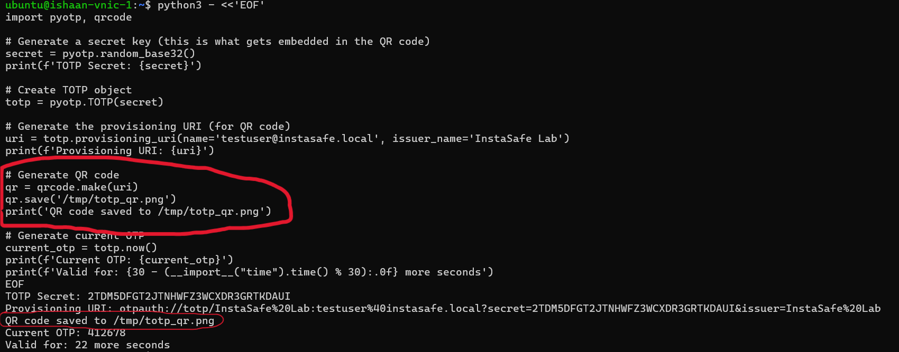
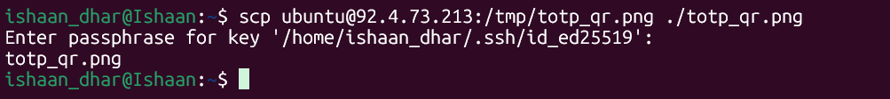
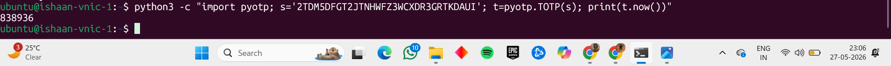
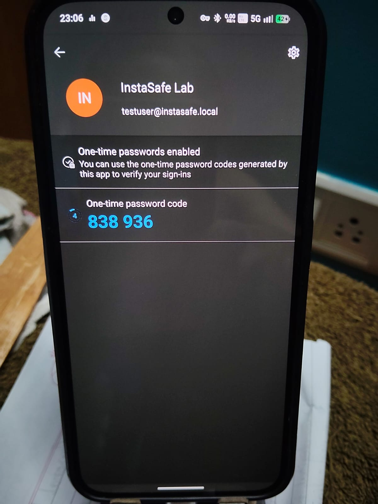
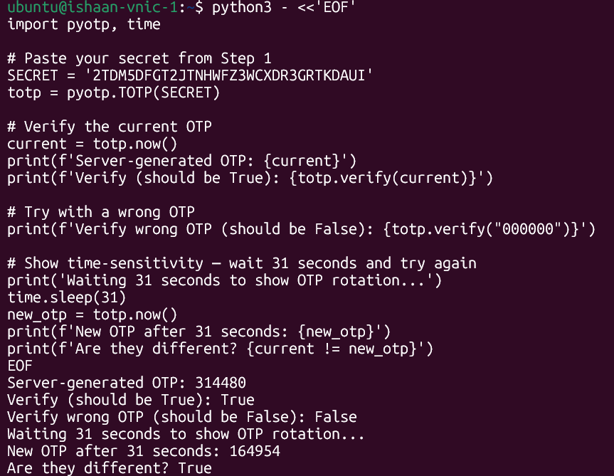
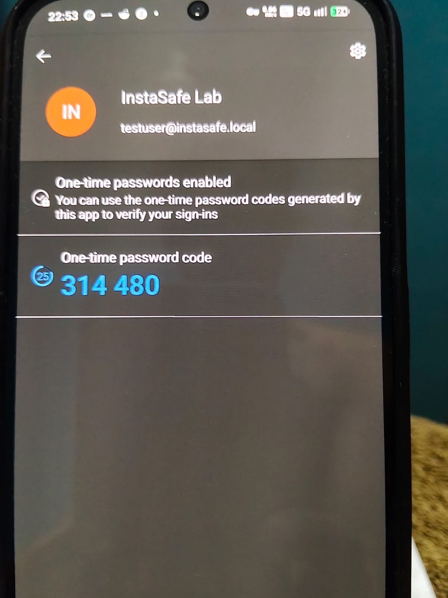
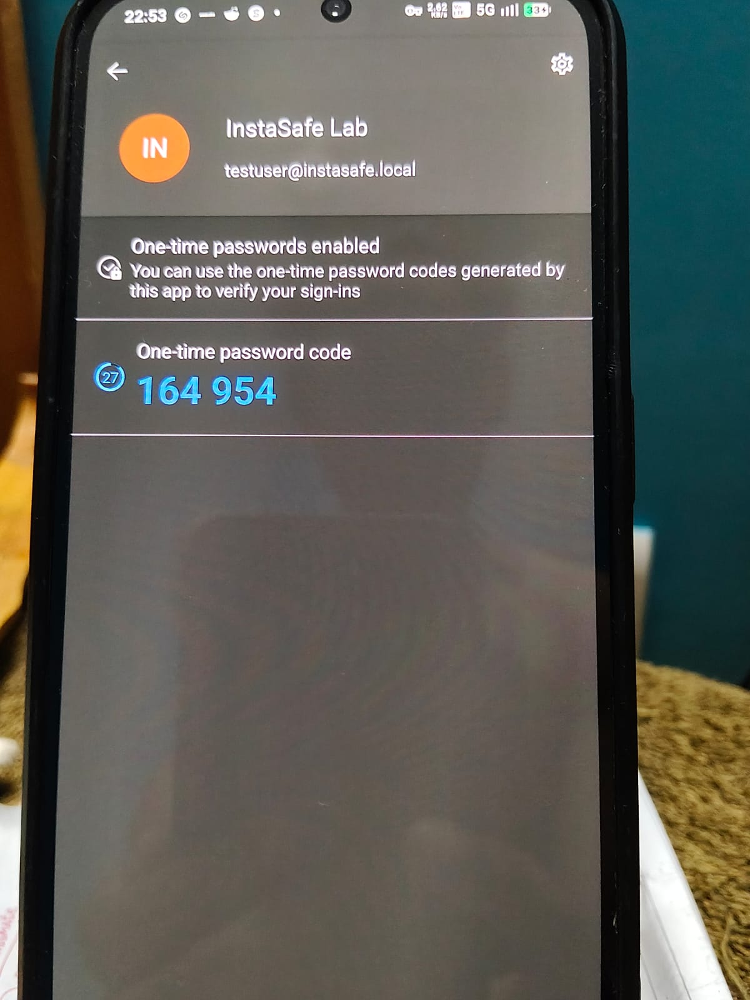

# Lab 2.3 Findings: TOTP MFA

## 1. Screenshot Evidence

**TOTP Secret Generated:**

-------------------------------------------------------------------------------------------------------------------------------------------------------------------------

**QR Code Generation:**

-------------------------------------------------------------------------------------------------------------------------------------------------------------------------

**QR Code Saved To PC:**

-------------------------------------------------------------------------------------------------------------------------------------------------------------------------

**QR Code:**

-------------------------------------------------------------------------------------------------------------------------------------------------------------------------

**Microsoft Authenticator-OTP Matching:**

-------------------------------------------------------------------------------------------------------------------------------------------------------------------------

**Time Rotation of OTPs- Old v/s New:**

----------------------------------------------------------------------------------------------------------------------------------------------------------------------------------------------------------------------------------------------------------------------------------------------------------------------------------------------------------------------------------------------------------------------------------------------------------------------------------------------------------------------------------------------------------------------------------------------------------------------------------------------------------------------------------------------------

## 2. Scenario Answer

**Scenario:** What causes TOTP failure in an enterprise? List 3 root causes and 1 diagnostic step each.

**Analysis of TOTP Failure Root Causes:**

1. **Incorrect Time Synchronization**

   * **Root Cause:** The TOTP is based entirely on the server and the client device having the same timestamp at the same time, or within 30 seconds of each other's time. If for some reason, like travel through timezones causes the timestamps to drift away from each other in what is called 'clock drift'. The codes will still be correct, but just at the wrong time with respect to each other.

   * **Diagnostic Step:** User can verify device time with a service like 'time.is', or turn off "Set time automatically" and then turn it on again to forcefully refresh the synchronisation.

2. **Incorrect Shared Secret(Incorrect Provisioning)**

   * **Root Cause:** Sometimes, due to incorrectly configured Base32 secret string (the secrets for both the client and server are different due to mistakes), the hashes generated by the server and the client application are therefore different, causing a failure in TOTP synchronisation. An admin can also change the configuration on the server, and the client might not have updated, leading to an error. This causes the hash generation to be done on different secrets, causing mismatch.

   * **Diagnostic Step:** User can delete the broken entry from their Authenticator app and re-provision by scanning a newly generated QR code.

3. **Slow Network or Slow User Input**

   * **Root Cause:** TOTP is generated every 30 seconds. If the OTP is entered in the last few seconds, then slow network connection or server processing delay can cause the request to reach the verifying step AFTER the time period has expired.

   * **Diagnostic Step:** Ideally, the OTP should be entered within the first 10 seconds of the cycle, to ensure no lags or delays cause the verification to fail.