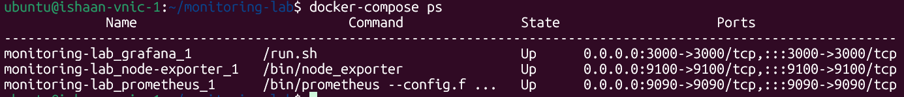
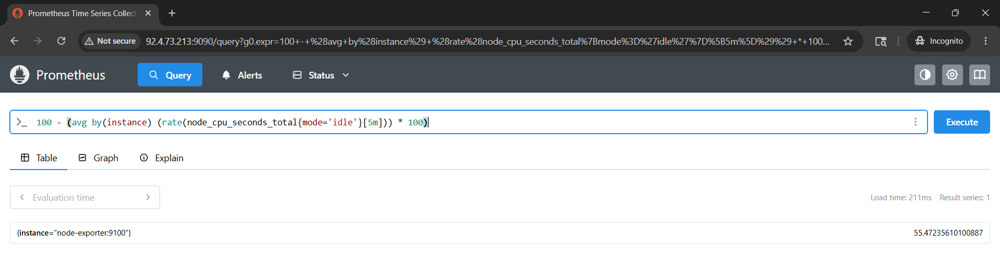
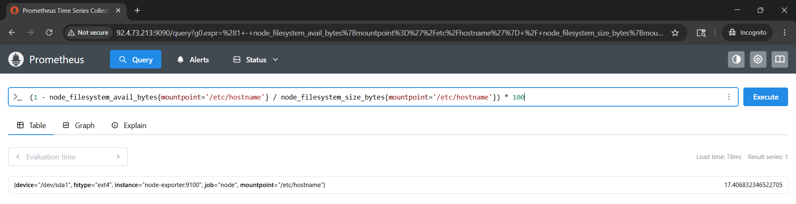
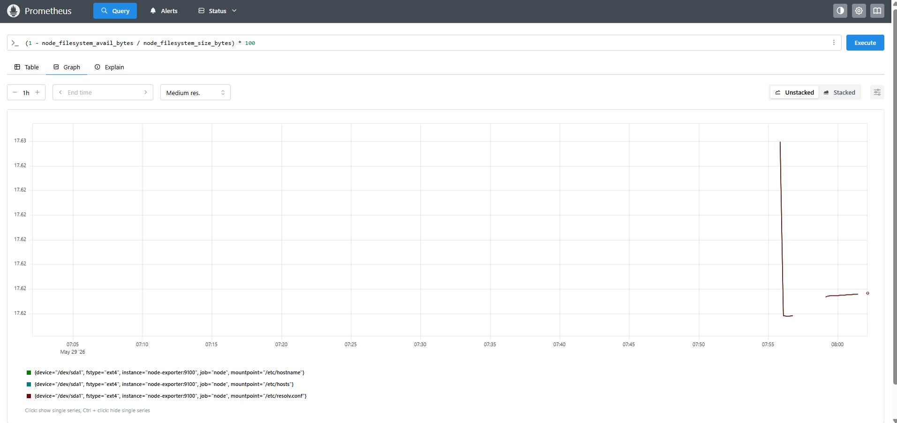
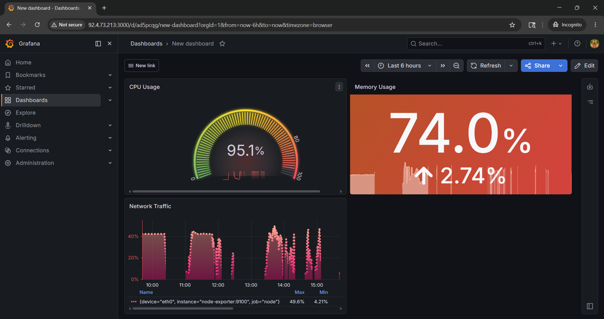

# Lab 3.2 Findings: Prometheus + Grafana Implemented

## 1. Screenshot Evidence

**docker-compose ps Shows All 3 As UP:**

-------------------------------------------------------------------------------------------------------------------------------------------------------------------------

**CPU Utilisation Query:**

**CPU Utilisation Graph:**

-------------------------------------------------------------------------------------------------------------------------------------------------------------------------

**Memory Utilisation Query:**

**Memory Utilisation Graph:**

-------------------------------------------------------------------------------------------------------------------------------------------------------------------------

**Disk Usage Query:**

**Disk Usage Graph:**

-------------------------------------------------------------------------------------------------------------------------------------------------------------------------

**Network Usage Query:**

**Network Usage Graph:**

-------------------------------------------------------------------------------------------------------------------------------------------------------------------------

**Grafana 3 Panel Dashboard:**

-------------------------------------------------------------------------------------------------------------------------------------------------------------------------
----------------------------------------------------------------------------------------------------------------------------------------------------------------------------------------------------------------------------------------------------------------------------------------------------------------------------------------------------------------------------------------------------------------------------------------------------------------------------------------------------------------------------------------------------------------------------------------------------------------------------------------------------------------------------------------------------

## 2. Scenario Answer

**Scenario:** What is the difference between what Prometheus/Grafana shows and what SigNoz shows? When would you use each during a P1 incident?

**Prometheus/Grafana vs. SigNoz:**
While both are monitoring tools, they monitor completely different layers.

* **Prometheus & Grafana (Infrastructure Monitoring):** These are used to monitor the physical or virtual hardware. They track system-level metrics like CPU usage, available RAM, disk space, and network bandwidth. Basically, they tell us about the health of the server.
* **SigNoz (Application Performance Monitoring - APM):** SigNoz looks entirely at the actual software code running on that server. Instead of just telling "the server is slow," SigNoz tells me exactly *why* the app is slow. It puts metrics, traces, and application logs all in one dashboard so it is pssibile to debug the software itself. It tells us about the health of the application on the server, and also why its health is going wrong, if and when it does.

**When to use each during a P1 incident:**
During a major P1 outage, I would use a "bottom-up" approach to troubleshoot:

1. **Check Grafana First:** Check the infrastructure dashboards to see if the server's hardware is failing (like the CPU being pegged at 100% or the hard drive being totally full). If the physical server is dead, the application will obviously be dead too.

2. **Check SigNoz Second:** If Grafana shows that the hardware is running perfectly fine, but users are still reporting errors or lag, switch to SigNoz. That allows checking the software side to figure out if a recent code update broke a specific point, or if an internal database is locking up the application.
