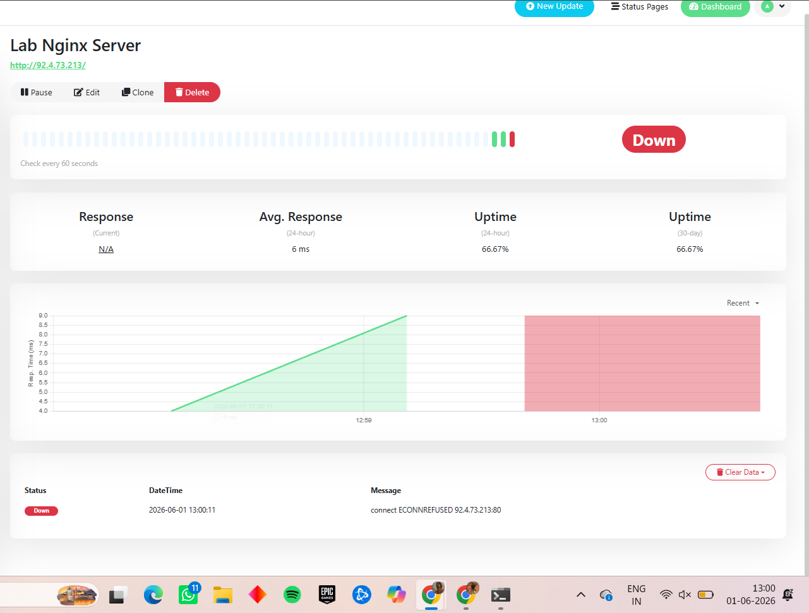
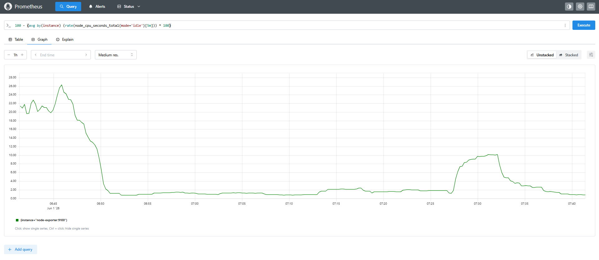
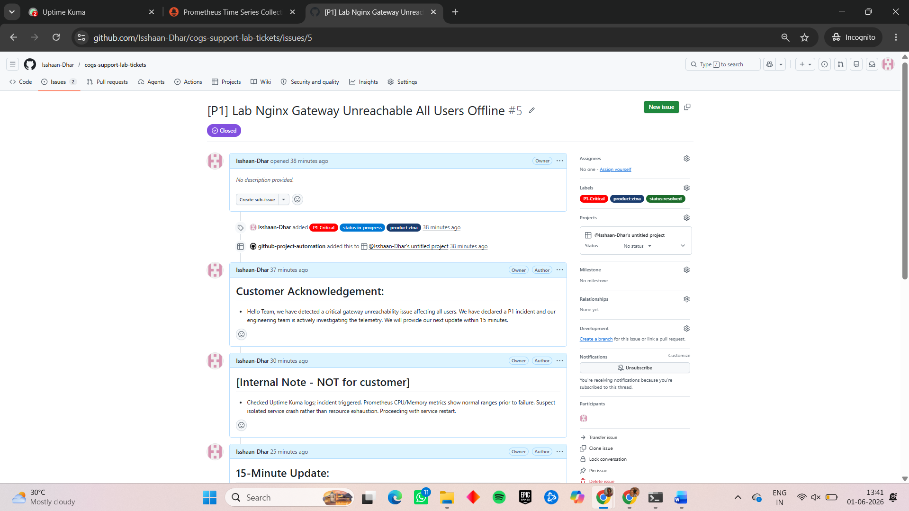
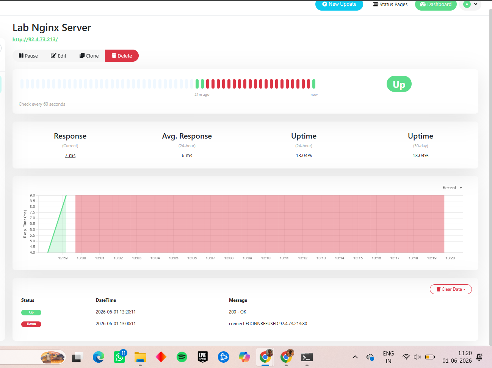

# Lab 5.1 Findings: Simulating and Responding a P1

## 1. Screenshot Evidence

**Uptime Kuma Red Alert with Timestamp:**

----------------------------------------------------------------------------------------------------------------------------------

**Prometheus Metrics Query Graph:**

----------------------------------------------------------------------------------------------------------------------------------

**GitHub P1 Ticket Creation with Timestamp:**

----------------------------------------------------------------------------------------------------------------------------------

**Uptime Kuma Green Recovery Alert with Timestamp:**

----------------------------------------------------------------------------------------------------------------------------------

**Links:**

View the [P1 Ticket Thread](https://github.com/Isshaan-Dhar/cogs-support-lab-tickets/issues/5).

View the [PIR](pirs/PIR-2026-06-01-Nginx-Crash.md)

View the [PACE Handover](handovers/handover-2026-06-01.md)

----------------------------------------------------------------------------------------------------------------------------------------------------------------------------------------------------------------------------------------------------------------------------------------------------------------------------------------------------------------------------------------------------------------------------------------------------------------------------------------------------------------------------------------